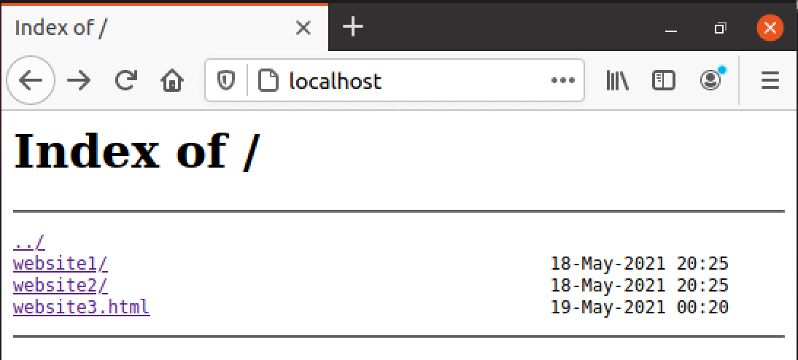

# NGINX setup instructions
Currently these instructions are for Ubuntu, might add for macOS in the future.

## Installing NGINX
```bash
sudo apt update
sudo apt install nginx
```

## Hosting a directory of websites
Starting nginx:
```bash
sudo systemctl start nginx
```

To host a directory of websites You can use our example directory [test-websites](./test-websites), or create Your own.

If You create Your own directory, it should follow such structure (these names are just for demonstration, You can use Your owm
instead of 'test-websites'):
```bash
test-websites/
|
|---website1/
|   |---index.html
|   |---...
|
|---website2/
|   |---index.html
|   |---...
|
|---website3.html
|
|---...
|
```
*Note: As You can see, You can host both lonely files and/or directories with files (which are not so lonely).*

To host such directory open file /etc/nginx/sites-enabled/default:
```bash
sudo vi /etc/nginx/sites-enabled/default
```

Replaces content of that file by such lines:
```bash
server {
        listen 80 default_server;
        listen [::]:80 default_server;
        
        # That path should be replaced by the correct one:
        root /home/user/test-websites; 
        autoindex on;

        server_name _;

        # That path should be replaced by the correct one:
        location /home/user/test-websites {
            try_files $uri $uri/ =404;
    }
}
```
**Important!** Please, replace */home/user/test_websites* by the full path to the directory with websites which
 You would like to host.
 
After that You should restart nginx:
```bash
sudo systemctl restart nginx
```

Now, if You used our example directory, at localhost/website1, localhost/website2 and localhost/website3.html You will be able to see
three slightly different websites.

On the localhost You will see index of the hosted websites:


If You need to stop nginx:
```bash
sudo systemctl stop nginx
```
 
## Deleting NGINX
Perhaps You get tired of hosting websites, or something goes horribly wrong and You would need to reinstall nginx again,
here is the way how You can delete it from the computer:
```bash
sudo apt-get purge nginx nginx-common
```