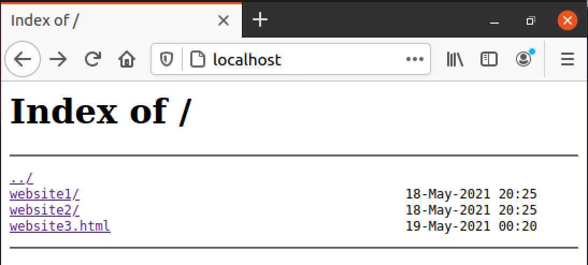

# NGINX setup instructions for hosting a web server on ram disk
Currently these instructions are for Ubuntu, might add for macOS in the future.

## Installing NGINX
```bash
sudo apt update
sudo apt install nginx
```

## Setting up directory for NGINX:
```bash
sudo vi /etc/nginx/sites-enabled/default
```

Replaces content of that file by such lines, we can possibly automate it later
```bash
server {
        listen 80 default_server;
        listen [::]:80 default_server;
        
        # That path should be replaced by the correct one:
        root /mnt/ramdisk/test-websites; 
        autoindex on;

        server_name _;

        # That path should be replaced by the correct one:
        location /mnt/ramdisk/test-websites {
            try_files $uri $uri/ =404;
    }
}
```

## Starting up the server
Starting nginx:
```bash
./commands_list.sh
```

To host a directory of websites You can use our example directory [test-websites](./test-websites), or create Your own.

*Note: The ./test-websites directory should be placed by /home/google/ location on web server*


If You create Your own directory, it should follow such structure (these names are just for demonstration, You can use Your owm
instead of 'test-websites'):
```bash
test-websites/
|
|---website1/
|   |---index.html
|   |---...
|
|---website2/
|   |---index.html
|   |---...
|
|---website3.html
|
|---...
|
```
*Note: As You can see, You can host both lonely files and/or directories with files (which are not so lonely).*


Now, if You used our example directory, at server_ip/website1, server_ip/website2 and server_ip/website3.html You will be able to see
three slightly different websites.

On the server_ip You will see index of the hosted websites:


If You need to stop nginx:
```bash
sudo systemctl stop nginx
```
 
## Deleting NGINX
Perhaps You get tired of hosting websites, or something goes horribly wrong and You would need to reinstall nginx again,
here is the way how You can delete it from the computer:
```bash
sudo apt-get purge nginx nginx-common
```